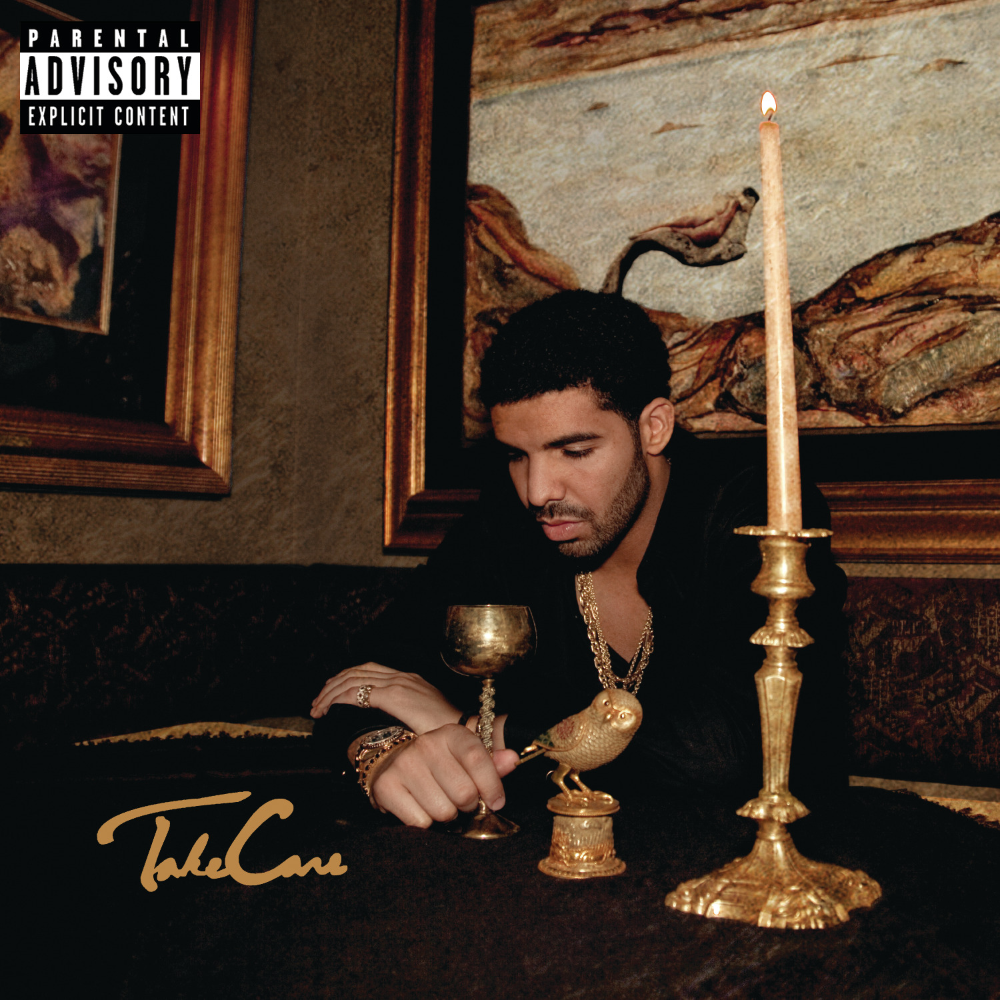

Select an album from the dropdown below to display its cover art:

```{=html}
<div style="margin: 20px 0;">
  <label for="albumSelect" class="form-label" style="font-weight: bold; margin-bottom: 8px; display: block;">Choose an Album:</label>
  <select id="albumSelect" class="form-select" style="max-width: 450px; padding: 8px; font-size: 16px;">
    <optgroup label="Drake">
      <option value="data/2006_room_for_improvement.jpg">Room for Improvement (2006)</option>
      <option value="data/2007_comeback_season.jpg">Comeback Season (2007)</option>
      <option value="data/2009_so_far_gone.jpg">So Far Gone (2009)</option>
      <option value="data/2010_thank_me_later.jpg">Thank Me Later (2010)</option>
      <option value="data/2011_take_care.jpg" selected>Take Care (2011)</option>
      <option value="data/2013_nothing_was_the_same.jpg">Nothing Was the Same (2013)</option>
      <option value="data/2015_if_youre_reading_this_its_too_late.jpg">If You’re Reading This It’s Too Late (2015)</option>
      <option value="data/2015_what_a_time_to_be_alive.jpg">What a Time to Be Alive (2015)</option>
      <option value="data/2016_views.jpg">Views (2016)</option>
      <option value="data/2017_more_life.jpg">More Life (2017)</option>
      <option value="data/2018_scorpion.jpg">Scorpion (2018)</option>
      <option value="data/2019_care_package.jpg">Care Package (2019)</option>
      <option value="data/2020_dark_lane_demo_tapes.jpg">Dark Lane Demo Tapes (2020)</option>
      <option value="data/2021_certified_lover_boy.jpg">Certified Lover Boy (2021)</option>
      <option value="data/2022_honestly_nevermind.jpg">Honestly, Nevermind (2022)</option>
      <option value="data/2022_her_loss.jpg">Her Loss (2022)</option>
      <option value="data/2023_for_all_the_dogs.jpg">For All the Dogs (2023)</option>
      <option value="data/2025_some_sexy_songs_4_u.jpg">$ome $exy $ongs 4 U (2025)</option>
    </optgroup>
    <optgroup label="fakemink">
      <option value="data/fakemink_2023_real_hospitality.jpg">real hospitality (2023)</option>
      <option value="data/fakemink_2023_londons_saviour.jpg">London's Saviour (2023)</option>
      <option value="data/fakemink_2024_wild_one.jpg">Wild One (2024)</option>
      <option value="data/fakemink_2024_furever.jpg">Furever (2024)</option>
      <option value="data/fakemink_2026_the_boy_who_cried_terrified.jpg">The Boy Who Cried Terrified (2026)</option>
      <option value="data/fakemink_2026_terrified.jpg">Terrified (2026)</option>
    </optgroup>
    <optgroup label="Feng">
      <option value="data/feng_2025_what_the_feng.jpg">What the Feng (2025)</option>
      <option value="data/feng_2026_weekend_rockstar.jpg">Weekend Rockstar (2026)</option>
      <option value="data/feng_2026_summer_at_camp_lakepine.jpg">Summer at Camp Lakepine (2026)</option>
    </optgroup>
  </select>
</div>

<div style="margin-top: 24px; display: flex; flex-wrap: wrap; gap: 28px; align-items: flex-start;">
  <div>
    
  </div>
  <div style="flex: 1; min-width: 260px;">
    <div style="background: #f8f9fa; border: 1px solid #dee2e6; border-radius: 8px; padding: 16px; margin-bottom: 16px;">
      <h4 style="margin-top: 0; color: #198754; font-size: 1.1rem;">Top 3 Most Streamed</h4>
      <ol id="top3List" style="margin-bottom: 0; padding-left: 20px;"></ol>
    </div>
    <div style="background: #f8f9fa; border: 1px solid #dee2e6; border-radius: 8px; padding: 16px;">
      <h4 style="margin-top: 0; color: #dc3545; font-size: 1.1rem;">Bottom 3 Most Streamed</h4>
      <ol id="bottom3List" style="margin-bottom: 0; padding-left: 20px;"></ol>
    </div>
  </div>
</div>

<div style="margin-top: 32px; padding-top: 24px; border-top: 1px solid #dee2e6;">
  <h3 style="margin-bottom: 8px;">Cover Art Similarity</h3>
  <p style="color: #6c757d; margin-bottom: 20px; font-size: 0.95rem;">Based on color palette and visual tone across all albums. Click either cover to select it.</p>
  <div style="display: flex; flex-wrap: wrap; gap: 24px;">
    <div id="mostSimilarCard" style="flex: 1; min-width: 240px; background: #f8f9fa; border: 1px solid #dee2e6; border-radius: 8px; padding: 16px; text-align: center; cursor: pointer;">
      <h5 style="color: #0d6efd; margin-top: 0; margin-bottom: 12px; font-size: 1.05rem;">Most Similar Cover</h5>
      
      <p id="mostSimilarTitle" style="font-weight: 600; margin-top: 10px; margin-bottom: 0;"></p>
    </div>
    <div id="leastSimilarCard" style="flex: 1; min-width: 240px; background: #f8f9fa; border: 1px solid #dee2e6; border-radius: 8px; padding: 16px; text-align: center; cursor: pointer;">
      <h5 style="color: #6c757d; margin-top: 0; margin-bottom: 12px; font-size: 1.05rem;">Least Similar Cover</h5>
      
      <p id="leastSimilarTitle" style="font-weight: 600; margin-top: 10px; margin-bottom: 0;"></p>
    </div>
  </div>
</div>

<div id="musicPlayerBar" style="position: fixed; bottom: 20px; right: 20px; z-index: 9999; background: rgba(18, 20, 35, 0.92); backdrop-filter: blur(12px); -webkit-backdrop-filter: blur(12px); border: 1px solid rgba(255, 255, 255, 0.2); border-radius: 40px; padding: 10px 18px; display: flex; align-items: center; gap: 10px; box-shadow: 0 8px 30px rgba(0,0,0,0.6); color: #fff;">
  <button id="prevBtn" title="Previous Album / Song" style="background: rgba(255,255,255,0.12); border: none; border-radius: 50%; width: 34px; height: 34px; color: white; display: flex; align-items: center; justify-content: center; cursor: pointer; font-size: 0.9rem; outline: none;">⏮</button>
  <button id="playPauseBtn" title="Play / Pause" style="background: #198754; border: none; border-radius: 50%; width: 40px; height: 40px; color: white; display: flex; align-items: center; justify-content: center; cursor: pointer; font-size: 1rem; box-shadow: 0 2px 8px rgba(25, 135, 84, 0.4); outline: none;">▶</button>
  <button id="skipBtn" title="Skip to Next Album / Song" style="background: rgba(255,255,255,0.12); border: none; border-radius: 50%; width: 34px; height: 34px; color: white; display: flex; align-items: center; justify-content: center; cursor: pointer; font-size: 0.9rem; outline: none;">⏭</button>
  <div style="font-size: 0.88rem; line-height: 1.25; max-width: 200px;">
    <div id="nowPlayingTitle" style="font-weight: 600; color: #fff; white-space: nowrap; overflow: hidden; text-overflow: ellipsis;">Headlines</div>
    <div id="playbackStatus" style="font-size: 0.75rem; color: #a0aec0;">Click anywhere to start music</div>
  </div>
  <audio id="albumAudio" preload="auto"></audio>
</div>

<script>
  const albumData = {
    "data/2006_room_for_improvement.jpg": {
      top3: ["Special (feat. Voyce)", "Do What You Do", "City Is Mine"],
      bottom3: ["Try Harder", "A Scorpio's Mind", "Come Winter"]
    },
    "data/2007_comeback_season.jpg": {
      top3: ["Replacement Girl (feat. Trey Songz)", "Going In For Life", "Closer"],
      bottom3: ["Where to Now", "Underdog", "The Presentation"]
    },
    "data/2009_so_far_gone.jpg": {
      top3: ["Best I Ever Had", "Little Bit", "Lust For Life"],
      bottom3: ["Unstoppable", "Congratulations", "Outro"]
    },
    "data/2010_thank_me_later.jpg": {
      top3: ["Fancy", "Shut It Down", "Fireworks"],
      bottom3: ["Light Up", "Karaoke", "Thank Me Now"]
    },
    "data/2011_take_care.jpg": {
      top3: ["Headlines", "Take Care", "Marvins Room"],
      bottom3: ["Buried Alive Interlude", "We'll Be Fine", "The Real Her"]
    },
    "data/2013_nothing_was_the_same.jpg": {
      top3: ["Hold On, We're Going Home", "From Time", "Pound Cake / Paris Morton Music 2"],
      bottom3: ["305 To My City", "Connect", "The Language"]
    },
    "data/2015_if_youre_reading_this_its_too_late.jpg": {
      top3: ["Know Yourself", "Energy", "Jungle"],
      bottom3: ["Used To", "Madonna", "6 Man"]
    },
    "data/2015_what_a_time_to_be_alive.jpg": {
      top3: ["Jumpman", "Jersey", "Digital Dash"],
      bottom3: ["I'm The Plug", "Change Locations", "Plastic Bag"]
    },
    "data/2016_views.jpg": {
      top3: ["One Dance", "Hotline Bling", "Too Good"],
      bottom3: ["Faithful", "Grammys", "Pop Style"]
    },
    "data/2017_more_life.jpg": {
      top3: ["Passionfruit", "Teenage Fever", "Get It Together"],
      bottom3: ["Glow", "Ice Melts", "Skepta Interlude"]
    },
    "data/2018_scorpion.jpg": {
      top3: ["God's Plan", "In My Feelings", "Don’t Matter To Me"],
      bottom3: ["March 14", "Is There More", "Ratchet Happy Birthday"]
    },
    "data/2019_care_package.jpg": {
      top3: ["Trust Issues", "Can I", "Club Paradise"],
      bottom3: ["Jodeci Freestyle", "Draft Day", "Heat Of The Moment"]
    },
    "data/2020_dark_lane_demo_tapes.jpg": {
      top3: ["Chicago Freestyle", "Not You Too", "Pain 1993"],
      bottom3: ["From Florida With Love", "Losses", "Landed"]
    },
    "data/2021_certified_lover_boy.jpg": {
      top3: ["Fair Trade", "Girls Want Girls", "Yebba’s Heartbreak"],
      bottom3: ["The Remorse", "7am On Bridle Path", "IMY2"]
    },
    "data/2022_honestly_nevermind.jpg": {
      top3: ["Jimmy Cooks", "A Keeper", "Flight's Booked"],
      bottom3: ["Liability", "Down Hill", "Tie That Binds"]
    },
    "data/2022_her_loss.jpg": {
      top3: ["Rich Flex", "Hours In Silence", "Pussy & Millions"],
      bottom3: ["3AM on Glenwood", "More M’s", "I Guess It’s Fuck Me"]
    },
    "data/2023_for_all_the_dogs.jpg": {
      top3: ["Rich Baby Daddy", "IDGAF", "Virginia Beach"],
      bottom3: ["Screw The World", "BBL Love", "All The Parties"]
    },
    "data/2025_some_sexy_songs_4_u.jpg": {
      top3: ["NOKIA", "DIE TRYING", "SOMEBODY LOVES ME"],
      bottom3: ["GLORIOUS", "LASERS", "WHEN HE'S GONE"]
    },
    "data/fakemink_2023_real_hospitality.jpg": {
      top3: ["metal gear", "china city", "thirty two teeth"],
      bottom3: ["thirty two teeth", "china city", "metal gear"]
    },
    "data/fakemink_2023_londons_saviour.jpg": {
      top3: ["Celebrity Deathmatch", "Just Kitten", "Kill Everything"],
      bottom3: ["Fleeting Feeling", "One More, Then I’ll Sleep", "Phantas-Ma-Goria"]
    },
    "data/fakemink_2024_wild_one.jpg": {
      top3: ["Blow Me", "Ambilux", "Truffle"],
      bottom3: ["Chinchilla", "Truffle", "Ambilux"]
    },
    "data/fakemink_2024_furever.jpg": {
      top3: ["High Like Me", "Shampoodle", "Hella"],
      bottom3: ["Animal Mintz", "Powder", "Hella"]
    },
    "data/fakemink_2026_the_boy_who_cried_terrified.jpg": {
      top3: ["Blow The Speaker .", "Young Millionaire .", "Mr. Chow ."],
      bottom3: ["fml .", "The Mercer .", "Dumb ."]
    },
    "data/fakemink_2026_terrified.jpg": {
      top3: ["Night , Blooming Jasmine .", "Rétard Angel .", "Like A Virgin"],
      bottom3: ["Fire & Ice .", "Etna .", "Jungle-Affair ."]
    },
    "data/feng_2025_what_the_feng.jpg": {
      top3: ["XY", "Left for USA", "YOLO"],
      bottom3: ["Soul 2 soul", "Me vs the world", "Memories"]
    },
    "data/feng_2026_weekend_rockstar.jpg": {
      top3: ["XOXO", "Cali Crazy", "Teenage Famous"],
      bottom3: ["Running Wild", "Don’t Be Normal", "Superstar"]
    },
    "data/feng_2026_summer_at_camp_lakepine.jpg": {
      top3: ["Coachella", "2023 Summer", "Smile Through The Pain"],
      bottom3: ["Diary", "Lets Make Out", "Vomit"]
    }
  };

  const similarityData = {
    "data/2006_room_for_improvement.jpg": {
      most_file: "data/2017_more_life.jpg",
      most_title: "More Life (2017)",
      least_file: "data/2015_if_youre_reading_this_its_too_late.jpg",
      least_title: "If You’re Reading This It’s Too Late (2015)"
    },
    "data/2007_comeback_season.jpg": {
      most_file: "data/2022_honestly_nevermind.jpg",
      most_title: "Honestly, Nevermind (2022)",
      least_file: "data/2015_if_youre_reading_this_its_too_late.jpg",
      least_title: "If You’re Reading This It’s Too Late (2015)"
    },
    "data/2009_so_far_gone.jpg": {
      most_file: "data/fakemink_2023_real_hospitality.jpg",
      most_title: "real hospitality (2023)",
      least_file: "data/2018_scorpion.jpg",
      least_title: "Scorpion (2018)"
    },
    "data/2010_thank_me_later.jpg": {
      most_file: "data/2015_if_youre_reading_this_its_too_late.jpg",
      most_title: "If You’re Reading This It’s Too Late (2015)",
      least_file: "data/2020_dark_lane_demo_tapes.jpg",
      least_title: "Dark Lane Demo Tapes (2020)"
    },
    "data/2011_take_care.jpg": {
      most_file: "data/2006_room_for_improvement.jpg",
      most_title: "Room for Improvement (2006)",
      least_file: "data/2015_if_youre_reading_this_its_too_late.jpg",
      least_title: "If You’re Reading This It’s Too Late (2015)"
    },
    "data/2013_nothing_was_the_same.jpg": {
      most_file: "data/2015_what_a_time_to_be_alive.jpg",
      most_title: "What a Time to Be Alive (2015)",
      least_file: "data/2020_dark_lane_demo_tapes.jpg",
      least_title: "Dark Lane Demo Tapes (2020)"
    },
    "data/2015_if_youre_reading_this_its_too_late.jpg": {
      most_file: "data/2021_certified_lover_boy.jpg",
      most_title: "Certified Lover Boy (2021)",
      least_file: "data/fakemink_2023_real_hospitality.jpg",
      least_title: "real hospitality (2023)"
    },
    "data/2015_what_a_time_to_be_alive.jpg": {
      most_file: "data/2022_her_loss.jpg",
      most_title: "Her Loss (2022)",
      least_file: "data/fakemink_2023_real_hospitality.jpg",
      least_title: "real hospitality (2023)"
    },
    "data/2016_views.jpg": {
      most_file: "data/fakemink_2026_terrified.jpg",
      most_title: "Terrified (2026)",
      least_file: "data/fakemink_2023_real_hospitality.jpg",
      least_title: "real hospitality (2023)"
    },
    "data/2017_more_life.jpg": {
      most_file: "data/2023_for_all_the_dogs.jpg",
      most_title: "For All the Dogs (2023)",
      least_file: "data/feng_2026_weekend_rockstar.jpg",
      least_title: "Weekend Rockstar (2026)"
    },
    "data/2018_scorpion.jpg": {
      most_file: "data/fakemink_2026_terrified.jpg",
      most_title: "Terrified (2026)",
      least_file: "data/fakemink_2023_real_hospitality.jpg",
      least_title: "real hospitality (2023)"
    },
    "data/2019_care_package.jpg": {
      most_file: "data/2009_so_far_gone.jpg",
      most_title: "So Far Gone (2009)",
      least_file: "data/2018_scorpion.jpg",
      least_title: "Scorpion (2018)"
    },
    "data/2020_dark_lane_demo_tapes.jpg": {
      most_file: "data/2006_room_for_improvement.jpg",
      most_title: "Room for Improvement (2006)",
      least_file: "data/2015_if_youre_reading_this_its_too_late.jpg",
      least_title: "If You’re Reading This It’s Too Late (2015)"
    },
    "data/2021_certified_lover_boy.jpg": {
      most_file: "data/2015_if_youre_reading_this_its_too_late.jpg",
      most_title: "If You’re Reading This It’s Too Late (2015)",
      least_file: "data/fakemink_2023_real_hospitality.jpg",
      least_title: "real hospitality (2023)"
    },
    "data/2022_honestly_nevermind.jpg": {
      most_file: "data/2023_for_all_the_dogs.jpg",
      most_title: "For All the Dogs (2023)",
      least_file: "data/feng_2026_weekend_rockstar.jpg",
      least_title: "Weekend Rockstar (2026)"
    },
    "data/2022_her_loss.jpg": {
      most_file: "data/feng_2026_summer_at_camp_lakepine.jpg",
      most_title: "Summer at Camp Lakepine (2026)",
      least_file: "data/fakemink_2023_real_hospitality.jpg",
      least_title: "real hospitality (2023)"
    },
    "data/2023_for_all_the_dogs.jpg": {
      most_file: "data/fakemink_2023_real_hospitality.jpg",
      most_title: "real hospitality (2023)",
      least_file: "data/2018_scorpion.jpg",
      least_title: "Scorpion (2018)"
    },
    "data/2025_some_sexy_songs_4_u.jpg": {
      most_file: "data/fakemink_2023_londons_saviour.jpg",
      most_title: "London's Saviour (2023)",
      least_file: "data/2018_scorpion.jpg",
      least_title: "Scorpion (2018)"
    },
    "data/fakemink_2023_real_hospitality.jpg": {
      most_file: "data/2023_for_all_the_dogs.jpg",
      most_title: "For All the Dogs (2023)",
      least_file: "data/2018_scorpion.jpg",
      least_title: "Scorpion (2018)"
    },
    "data/fakemink_2023_londons_saviour.jpg": {
      most_file: "data/2011_take_care.jpg",
      most_title: "Take Care (2011)",
      least_file: "data/2015_if_youre_reading_this_its_too_late.jpg",
      least_title: "If You’re Reading This It’s Too Late (2015)"
    },
    "data/fakemink_2024_wild_one.jpg": {
      most_file: "data/2011_take_care.jpg",
      most_title: "Take Care (2011)",
      least_file: "data/2015_if_youre_reading_this_its_too_late.jpg",
      least_title: "If You’re Reading This It’s Too Late (2015)"
    },
    "data/fakemink_2024_furever.jpg": {
      most_file: "data/fakemink_2023_londons_saviour.jpg",
      most_title: "London's Saviour (2023)",
      least_file: "data/2015_if_youre_reading_this_its_too_late.jpg",
      least_title: "If You’re Reading This It’s Too Late (2015)"
    },
    "data/fakemink_2026_the_boy_who_cried_terrified.jpg": {
      most_file: "data/2022_honestly_nevermind.jpg",
      most_title: "Honestly, Nevermind (2022)",
      least_file: "data/2018_scorpion.jpg",
      least_title: "Scorpion (2018)"
    },
    "data/fakemink_2026_terrified.jpg": {
      most_file: "data/2016_views.jpg",
      most_title: "Views (2016)",
      least_file: "data/fakemink_2023_real_hospitality.jpg",
      least_title: "real hospitality (2023)"
    },
    "data/feng_2025_what_the_feng.jpg": {
      most_file: "data/feng_2026_weekend_rockstar.jpg",
      most_title: "Weekend Rockstar (2026)",
      least_file: "data/fakemink_2023_real_hospitality.jpg",
      least_title: "real hospitality (2023)"
    },
    "data/feng_2026_weekend_rockstar.jpg": {
      most_file: "data/2015_if_youre_reading_this_its_too_late.jpg",
      most_title: "If You’re Reading This It’s Too Late (2015)",
      least_file: "data/fakemink_2023_real_hospitality.jpg",
      least_title: "real hospitality (2023)"
    },
    "data/feng_2026_summer_at_camp_lakepine.jpg": {
      most_file: "data/2022_her_loss.jpg",
      most_title: "Her Loss (2022)",
      least_file: "data/fakemink_2023_real_hospitality.jpg",
      least_title: "real hospitality (2023)"
    }
  };

  const selector = document.getElementById('albumSelect');
  const image = document.getElementById('albumDisplay');
  const top3List = document.getElementById('top3List');
  const bottom3List = document.getElementById('bottom3List');

  const mostSimImg = document.getElementById('mostSimilarImg');
  const mostSimTitle = document.getElementById('mostSimilarTitle');
  const leastSimImg = document.getElementById('leastSimilarImg');
  const leastSimTitle = document.getElementById('leastSimilarTitle');
  const mostSimCard = document.getElementById('mostSimilarCard');
  const leastSimCard = document.getElementById('leastSimilarCard');

  const audioPlayer = document.getElementById('albumAudio');
  const playPauseBtn = document.getElementById('playPauseBtn');
  const prevBtn = document.getElementById('prevBtn');
  const skipBtn = document.getElementById('skipBtn');
  const nowPlayingTitle = document.getElementById('nowPlayingTitle');
  const playbackStatus = document.getElementById('playbackStatus');
  let isPlaying = false;

  function playAudio() {
    audioPlayer.play().then(() => {
      isPlaying = true;
      playPauseBtn.textContent = '⏸';
      playPauseBtn.style.background = '#dc3545';
      playbackStatus.textContent = 'Preview playing';
    }).catch(() => {
      // Browser autoplay policy requires user interaction first
    });
  }

  function pauseAudio() {
    audioPlayer.pause();
    isPlaying = false;
    playPauseBtn.textContent = '▶';
    playPauseBtn.style.background = '#198754';
    playbackStatus.textContent = 'Paused';
  }

  function skipNext() {
    const options = Array.from(selector.options);
    let nextIndex = (selector.selectedIndex + 1) % options.length;
    selector.selectedIndex = nextIndex;
    updateDisplay(selector.value);
    playAudio();
  }

  function skipPrev() {
    const options = Array.from(selector.options);
    let prevIndex = (selector.selectedIndex - 1 + options.length) % options.length;
    selector.selectedIndex = prevIndex;
    updateDisplay(selector.value);
    playAudio();
  }

  playPauseBtn.addEventListener('click', function(e) {
    e.stopPropagation();
    if (isPlaying) {
      pauseAudio();
    } else {
      playAudio();
    }
  });

  skipBtn.addEventListener('click', function(e) {
    e.stopPropagation();
    skipNext();
  });

  prevBtn.addEventListener('click', function(e) {
    e.stopPropagation();
    skipPrev();
  });

  audioPlayer.addEventListener('ended', function() {
    skipNext();
  });

  document.addEventListener('pointerdown', function() {
    if (!isPlaying) {
      playAudio();
    }
  }, { once: true });

  function updateDisplay(albumKey) {
    image.src = albumKey;
    const data = albumData[albumKey] || { top3: [], bottom3: [] };
    top3List.innerHTML = data.top3.map(song => `<li>${song}</li>`).join('');
    bottom3List.innerHTML = data.bottom3.map(song => `<li>${song}</li>`).join('');

    const sim = similarityData[albumKey];
    if (sim) {
      mostSimImg.src = sim.most_file;
      mostSimTitle.textContent = sim.most_title;
      leastSimImg.src = sim.least_file;
      leastSimTitle.textContent = sim.least_title;
    }

    const topSong = (data.top3 && data.top3[0]) ? data.top3[0] : 'Track Preview';
    nowPlayingTitle.textContent = topSong;
    const audioPath = albumKey.replace('data/', 'data/audio/').replace('.jpg', '.mp3');
    if (!audioPlayer.src.endsWith(audioPath)) {
      audioPlayer.src = audioPath;
      if (isPlaying) {
        audioPlayer.play().catch(() => {});
      }
    }
  }

  mostSimCard.addEventListener('click', function() {
    const sim = similarityData[selector.value];
    if (sim && sim.most_file) {
      selector.value = sim.most_file;
      updateDisplay(selector.value);
    }
  });

  leastSimCard.addEventListener('click', function() {
    const sim = similarityData[selector.value];
    if (sim && sim.least_file) {
      selector.value = sim.least_file;
      updateDisplay(selector.value);
    }
  });

  selector.addEventListener('change', function() {
    updateDisplay(this.value);
    if (!isPlaying) {
      playAudio();
    }
  });

  updateDisplay(selector.value);

  // Floating background covers with scroll parallax
  const bgContainer = document.createElement('div');
  bgContainer.id = 'floating-covers-bg';
  bgContainer.setAttribute('aria-hidden', 'true');
  document.body.prepend(bgContainer);

  const allAlbumKeys = Object.keys(albumData);
  allAlbumKeys.forEach((src, idx) => {
    const img = document.createElement('img');
    img.className = 'floating-cover';
    img.src = src;
    img.alt = '';
    const colPercent = ((idx * 3.8) % 92) + (Math.random() * 4 - 2);
    img.style.left = `${Math.max(2, Math.min(92, colPercent))}%`;
    const size = 85 + (idx % 4) * 20;
    img.style.width = `${size}px`;
    const duration = 22 + (idx % 5) * 4;
    img.style.animationDuration = `${duration}s`;
    img.style.animationDelay = `-${(idx * 2.5) % duration}s`;
    img.style.animationName = idx % 2 === 0 ? 'floatDrift1' : 'floatDrift2';
    img.style.animationTimingFunction = 'linear';
    img.style.animationIterationCount = 'infinite';
    bgContainer.appendChild(img);
  });

  window.addEventListener('scroll', function() {
    const scrollOffset = window.scrollY * 0.2;
    bgContainer.style.transform = `translateY(-${scrollOffset}px)`;
  }, { passive: true });
</script>
```
